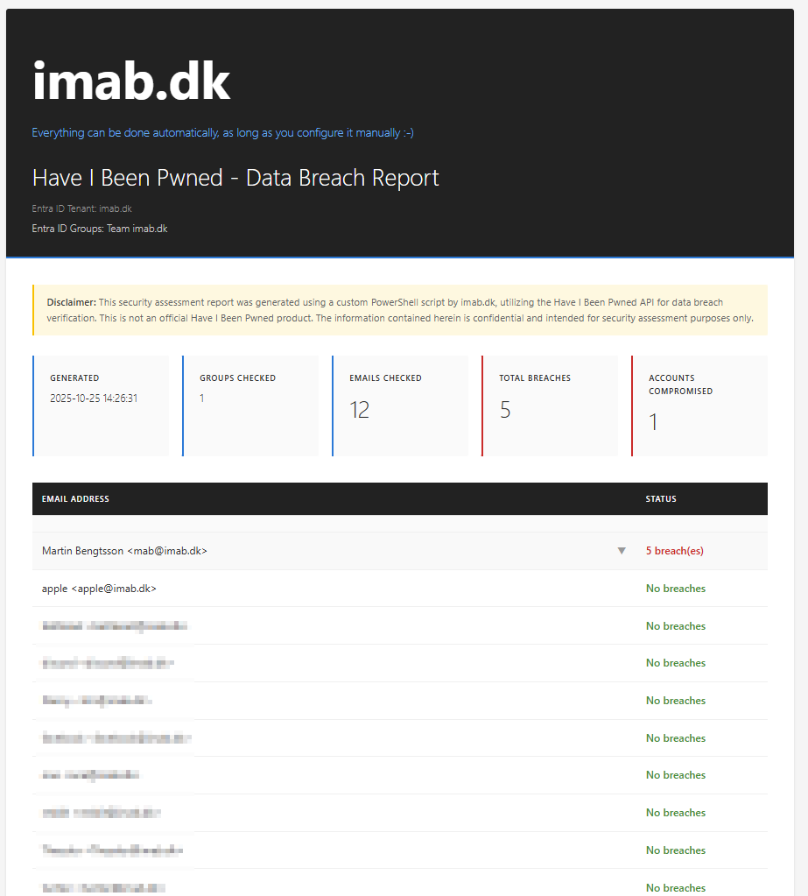

# EntraID-HaveIBeenPwned-BreachChecker


Automated PowerShell tool for checking Entra ID (Azure AD) group members against the Have I Been Pwned database. Generate professional HTML and PDF reports for security audits, compliance, and executive briefings.

> **Everything can be done automatically** - [imab.dk](https://www.imab.dk)

## ✨ Features

- 🔐 **Automated breach checking** for Entra ID groups
- 📊 **Professional HTML/PDF reports** with executive summaries
- ⚡ **Smart rate limiting** - supports all 5 HIBP subscription tiers (10-1000 req/min)
- 🎯 **Nested group support** with flexible selection by name or Object ID
- 🔒 **Secure** - no data stored, read-only permissions, OAuth authentication

### 📸 Sample Report


*Professional HTML report with executive summary and detailed breach information*

## 📋 Prerequisites

1. [Have I Been Pwned API Key](https://haveibeenpwned.com/API/Key)
2. PowerShell 5.1 or later
3. Microsoft Graph PowerShell SDK
4. HaveIBeenPwned PowerShell Module
5. Entra ID permissions: `Group.Read.All` and `User.Read.All`

## 🚀 Quick Start

```powershell
# Install modules
Install-Module Microsoft.Graph, HaveIBeenPwned -Scope CurrentUser

# Clone repository
git clone https://github.com/yourusername/EntraID-BreachChecker.git

# Run
.\Check-GroupMembersHaveIBeenPwned.ps1 -GroupName "IT Department" -ApiKey "your-api-key"
```

## 💻 Usage Examples

```powershell
# Basic usage
.\Check-GroupMembersHaveIBeenPwned.ps1 -GroupName "IT Department" -ApiKey "your-key"

# With PDF generation
.\Check-GroupMembersHaveIBeenPwned.ps1 -GroupName "IT Department" -ApiKey "your-key" -GeneratePdf

# Higher rate limit (Pwned 3 tier - 100 req/min)
.\Check-GroupMembersHaveIBeenPwned.ps1 -GroupName "IT Department" -ApiKey "your-key" -RateLimitPerMinute '100'
```

## 📊 Rate Limiting

| Tier | Requests/Min | Delay | Use Case |
|------|--------------|-------|----------|
| Pwned 1 | 10 | 6s | Small teams |
| Pwned 2 | 50 | 1.2s | Medium orgs |
| Pwned 3 | 100 | 600ms | Large orgs |
| Pwned 4 | 500 | 120ms | Enterprise |
| Pwned 5 | 1000 | 60ms | Large enterprise |

## 📖 Parameters

| Parameter | Required | Default | Description |
|-----------|----------|---------|-------------|
| `GroupName` | No* | - | Group display name(s) |
| `GroupId` | No* | - | Group Object ID(s) |
| `ApiKey` | Yes | - | HIBP API key |
| `RateLimitPerMinute` | No | '10' | '10', '50', '100', '500', '1000' |
| `ExpandNestedGroups` | No | False | Include nested groups |
| `GeneratePdf` | No | False | Create PDF report |

*Either `GroupName` or `GroupId` required.

## ⚠️ Disclaimer

This script is provided "as-is" without warranties. Test before using in production. The author takes no responsibility for any issues arising from use of this tool.

## 👤 Author

**Martin Bengtsson** - [imab.dk](https://www.imab.dk)

📝 Blog: [Automating 'Have I Been Pwned' Breach Checks for Entra ID Groups](https://www.imab.dk/powershell-script-automated-have-i-been-pwned-breach-checks-for-entra-id-groups/)

## 📄 License

MIT License - see [LICENSE](LICENSE) file for details.

---

**Remember**: Everything can be done automatically, as long as you configure it manually! 🚀

